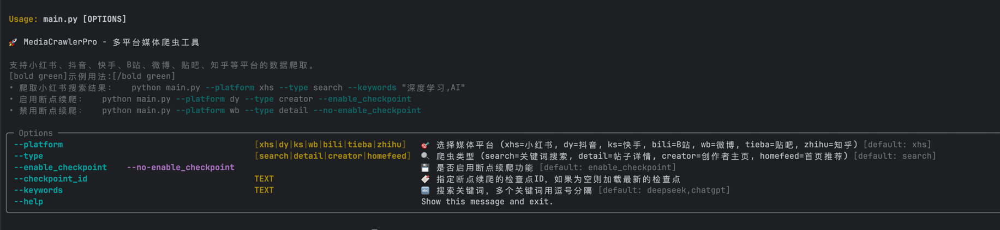
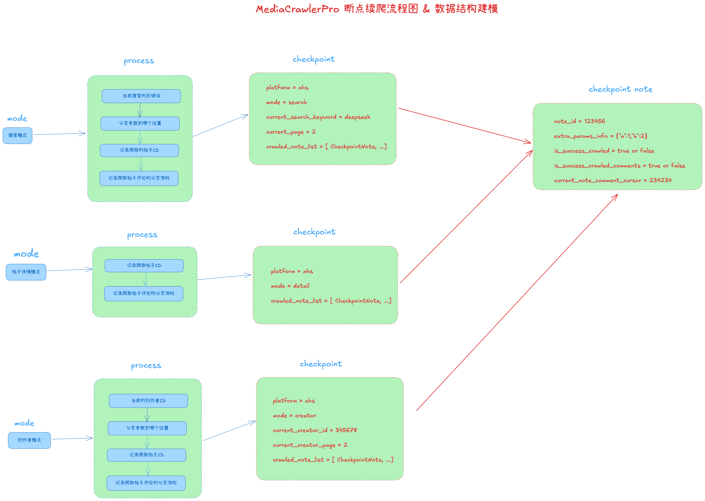
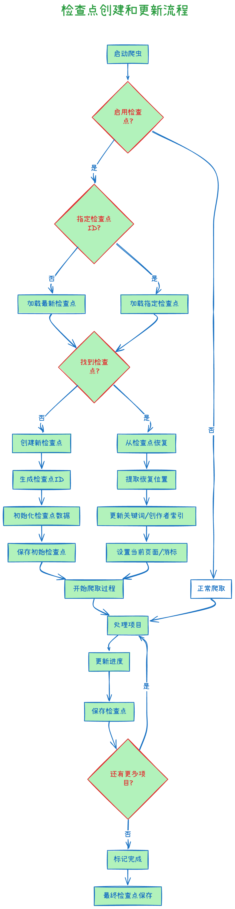
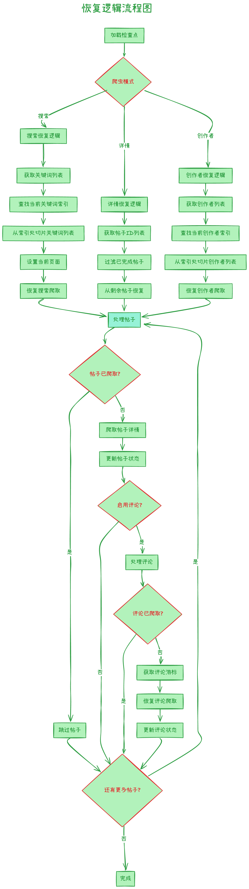

# 断点续爬系统文档

## ⚠️ 重要声明

**本项目仅供学习和研究目的使用**，使用者应严格遵守以下原则：

1. **不得用于任何商业用途**
2. 使用时应遵守目标平台的使用条款和robots.txt规则
3. 不得进行大规模爬取或对平台造成运营干扰
4. 应合理控制请求频率，避免给目标平台带来不必要的负担
5. 不得用于任何非法或不当的用途

详细许可条款请参阅项目根目录下的 [LICENSE](../LICENSE) 文件。使用本代码即表示您同意遵守上述原则和LICENSE中的所有条款。

---

## 概述

MediaCrawlerPro 断点续爬系统提供强大的断点爬取功能，允许爬虫在中断后从确切的位置恢复爬取。该系统支持多个平台（小红书、贴吧、抖音等）和存储后端（文件/Redis）。

### 核心特性
- **平台无关性**：适用于所有支持的平台
- **多种存储后端**：基于文件和基于Redis的存储
- **细粒度恢复**：支持关键词、页面、帖子或评论级别的恢复
- **并发安全**：使用异步锁的线程安全操作
- **自动清理**：可配置的检查点过期时间

## 用户指南

### 启用断点续爬

要启用断点续爬功能，请在 `config.py` 中配置以下设置：

```python
# 启用断点续爬
ENABLE_CHECKPOINT = True

# 可选：指定要恢复的检查点ID
SPECIFIED_CHECKPOINT_ID = ""  # 留空表示使用最新的

# 存储后端（file 或 redis）
CHECKPOINT_STORAGE_TYPE = "file"  # 或 "redis"
```

### 命令行参数说明

MediaCrawlerPro 使用现代化的 Typer CLI 提供友好的命令行界面。以下是与断点续爬相关的主要参数：

#### 基础参数
```bash
# 查看完整的帮助信息
python main.py --help

# 基本爬取命令
python main.py --platform [平台] --type [类型] [其他选项]
```


#### 断点续爬相关参数

| 参数 | 类型 | 说明 | 示例 |
|------|------|------|------|
| `--enable_checkpoint` | 布尔 | 启用断点续爬功能 | `--enable_checkpoint` |
| `--no-enable_checkpoint` | 布尔 | 禁用断点续爬功能 | `--no-enable_checkpoint` |
| `--checkpoint_id` | 字符串 | 指定要恢复的检查点ID | `--checkpoint_id "xhs_search_20240617183823"` |


### 使用断点续爬

#### 1. 开始新的爬取会话
当您开始爬取时，系统会自动创建检查点：

```bash
# 使用新的 Typer CLI 语法
python main.py --platform xhs --type search --enable_checkpoint
```

系统将：
- 创建格式为 `{platform}_{mode}_{timestamp}` 的新检查点ID
- 例如：`xhs_search_20240617183823`
- 在爬取过程中自动保存进度

#### 2. 从中断处恢复
如果爬取被中断，只需使用相同配置重新启动：

```bash
# 断点续爬默认启用，系统会自动恢复
python main.py --platform xhs --type search --enable_checkpoint
```

系统将：
- 自动检测最新的检查点
- 从最后保存的位置恢复
- 无缝继续爬取

#### 3. 从特定检查点恢复
要从特定检查点恢复，可以通过命令行参数指定：

```bash
# 通过命令行参数指定检查点ID
python main.py --platform xhs --type search --enable_checkpoint --checkpoint_id "xhs_search_20240617183823"
```

或者在配置文件中设置：

```python
# 在 config.py 中
SPECIFIED_CHECKPOINT_ID = "xhs_search_20240617183823"
```

#### 4. 完整的使用示例

以下是一些常见的断点续爬使用场景：

```bash
# 小红书搜索爬取，启用断点续爬
python main.py --platform xhs --type search --enable_checkpoint

# 微博详情爬取，禁用断点续爬
python main.py --platform wb --type detail --no-enable_checkpoint

# 从特定检查点恢复小红书搜索
python main.py --platform xhs --type search --checkpoint_id "xhs_search_20240617183823"

```


### 按爬虫类型的恢复粒度

#### 搜索模式恢复
- **关键词级别**：从关键词列表中的特定关键词恢复
- **页面级别**：从当前关键词内的特定页面恢复
- **帖子级别**：跳过已处理的帖子
- **评论级别**：从最后的游标位置恢复评论爬取

#### 详情模式恢复
- **帖子级别**：跳过指定列表中已处理的帖子
- **评论级别**：为未完成的帖子恢复评论爬取

#### 创作者模式恢复
- **创作者级别**：从创作者列表中的特定创作者恢复
- **帖子级别**：跳过当前创作者的已处理帖子
- **评论级别**：从最后位置恢复评论爬取

## 技术设计

### 业务流程图


### 数据模型

检查点系统使用两个主要模型：

#### 检查点模型
```python
class Checkpoint(BaseModel):
    # 主键
    id: Optional[str] = None
    
    # 基础字段
    platform: str  # "xhs", "tieba", "dy" 等
    mode: str      # "search", "detail", "creator", "homefeed"
    
    # 搜索模式字段
    current_search_keyword: Optional[str] = None
    current_search_page: Optional[int] = None
    current_search_id: Optional[str] = None
    
    # 创作者模式字段
    current_creator_id: Optional[str] = None
    current_creator_page: Optional[str] = None
    
    # 首页推荐流字段
    current_homefeed_cursor: Optional[str] = None
    current_homefeed_note_index: Optional[int] = None
    
    # 帖子跟踪
    crawled_note_list: Optional[List[CheckpointNote]] = None
```

#### 检查点帖子模型
```python
class CheckpointNote(BaseModel):
    note_id: str
    extra_params_info: Optional[Dict[str, Any]] = None
    is_success_crawled: bool = False
    is_success_crawled_comments: bool = False
    current_note_comment_cursor: Optional[str] = None
```

### 存储后端

#### 文件存储实现
- **位置**：`data/checkpoints/`
- **格式**：命名为 `{checkpoint_id}.json` 的JSON文件


#### Redis存储实现
- **键格式**：`checkpoint:{checkpoint_id}`
- **过期时间**：可配置TTL（默认7天）


### 检查点创建和更新流程

以下图表显示了爬取过程中检查点的创建和更新方式：

<div style="max-width: 100%; overflow-x: auto;">
  
</div>

### 恢复逻辑流程图

以下图表说明了系统如何根据检查点数据确定恢复爬取的位置：

<div style="max-width: 100%; overflow-x: auto;">
  
</div>


### 检查点数据结构示例

#### 搜索模式检查点
```json
{
  "id": "xhs_search_20240617183823",
  "platform": "xhs",
  "mode": "search",
  "current_search_keyword": "deepseek",
  "current_search_page": 3,
  "current_search_id": null,
  "current_creator_id": null,
  "current_creator_page": null,
  "current_homefeed_cursor": null,
  "current_homefeed_note_index": null,
  "crawled_note_list": [
    {
      "note_id": "65a1b2c3d4e5f6789",
      "extra_params_info": {
        "xsec_source": "pc_search",
        "xsec_token": "ABtXzgN9VSqUzCC0EADDzk7xU4iL-O1Y106JWqnvLJoic="
      },
      "is_success_crawled": true,
      "is_success_crawled_comments": true,
      "current_note_comment_cursor": "65a1b2c3d4e5f6789_1640995200"
    },
    {
      "note_id": "65a1b2c3d4e5f6790",
      "extra_params_info": {
        "xsec_source": "pc_search",
        "xsec_token": "ABtXzgN9VSqUzCC0EADDzk7xU4iL-O1Y106JWqnvLJoic="
      },
      "is_success_crawled": true,
      "is_success_crawled_comments": false,
      "current_note_comment_cursor": "65a1b2c3d4e5f6790_1640995100"
    }
  ]
}
```

#### 创作者模式检查点
```json
{
  "id": "xhs_creator_20240617184523",
  "platform": "xhs",
  "mode": "creator",
  "current_search_keyword": null,
  "current_search_page": null,
  "current_search_id": null,
  "current_creator_id": "https://www.xiaohongshu.com/user/profile/58abbcfa6a6a692b3dd6b2d8",
  "current_creator_page": "2",
  "current_homefeed_cursor": null,
  "current_homefeed_note_index": null,
  "crawled_note_list": [
    {
      "note_id": "creator_note_123",
      "extra_params_info": {
        "creator_id": "58abbcfa6a6a692b3dd6b2d8"
      },
      "is_success_crawled": true,
      "is_success_crawled_comments": true,
      "current_note_comment_cursor": "completed"
    }
  ]
}
```

#### 贴吧搜索模式检查点
```json
{
  "id": "tieba_search_20240617185023",
  "platform": "tieba",
  "mode": "search",
  "current_search_keyword": "chatgpt",
  "current_search_page": 5,
  "current_search_id": null,
  "current_creator_id": null,
  "current_creator_page": null,
  "current_homefeed_cursor": null,
  "current_homefeed_note_index": null,
  "crawled_note_list": [
    {
      "note_id": "7280854932641664319",
      "extra_params_info": {},
      "is_success_crawled": true,
      "is_success_crawled_comments": true,
      "current_note_comment_cursor": "completed"
    }
  ]
}
```

## 故障排除
> 新上的功能，如果有任何使用问题或者Bug，欢迎大家在issue中提问题

### 常见问题和解决方案
> 等待反馈收集中


